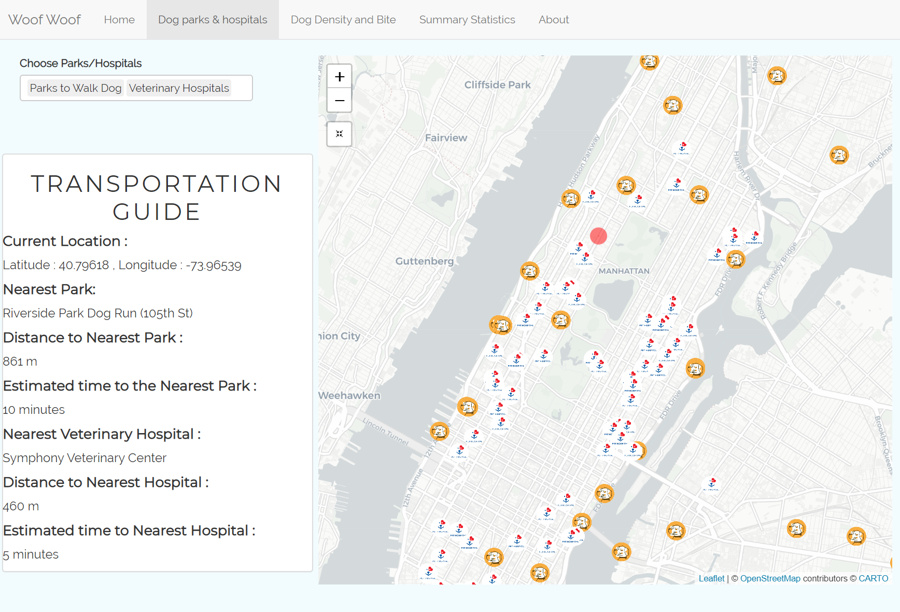
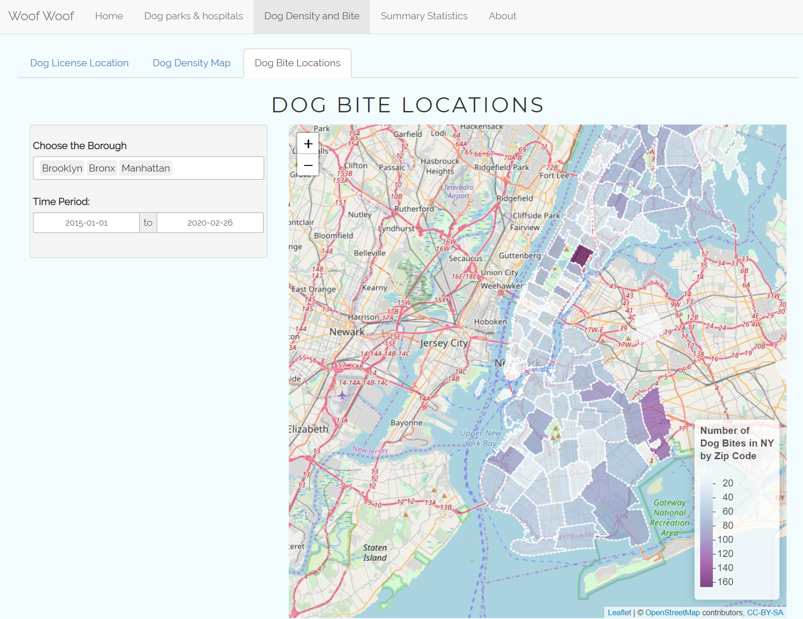

# Project 2: Shiny App Development






## NYC Neighborhoods Overview For Dogs
Term: Spring 2020

+ Team # 1

+ Shiny Link : https://loving-dogs.shinyapps.io/Group1_Project2/

+ **Team Members**: 
    + Feng, Kangli (Team Leader) [kf2616@columbia.edu](kf2616@columbia.edu)
	+ Du, Jinxiao [jd3607@columbia.edu](jd3607@columbia.edu)
	+ Zhu, Huize [hz2657@columbia.edu](hz2657@columbia.edu)
	+ Lyu, Wenfeng [wl2733@columbia.edu](wl2733@columbia.edu)
	+ Chen, Shenhan (Presenter) [sc4615@columbia.edu](sc4615@columbia.edu)

+ **Project summary**: 

In a city of cramped living quarters, fifth-floor walk-ups and limited access to outdoor space, you may think pets would be a tough sell for New York City residents. Yet roughly 425,000 dogs live in New York City – more dogs than there are people in Oakland, CA.

To develop this project, we referenced the data on NYC Open Data, as well as other open data sources such as Google, Github and Kaggle, to uncover the most popular dog breeds and names in NYC neighborhoods, and the best neighborhoods in New York City for dogs and their faithful owners. Moreover, we included the statistical analysis of the most dog bites occurence in NYC neighborhoods for those people who want to live in the neighborhoods with fewer dogs. Our project goal is to help you get extensive dog-related information around NYC's neighborhoods.


+ **Contribution statement**:

All team members approve our work presented in this GitHub repository including this contributions statement. The contribution detail is as follows:

	+ Du, Jinxiao: Finished the cluster points map of Dog Licenses and heatmap of Dog Licenses both by myself. Processed the data of Dog Licenses and design the format of Map page. Besides, help other members debug.
	
	+ Feng, Kangli: Designed the template for the Shiny App page including html files for `Home` and `About` page. Cleaned, tidied and visualized data of veterinary hospitals and dog runs area. Calculated and displayed estimated distance and time taken to the nearest hospital and park from any given location. Integrated and tidied other teammates’ work
	
	+ Lyu, Wenfeng: Data cleaning, design the statistics tab and the content format, including the popular nyc dog names by year bar chart, as well as the popular dog breed plotly bar chart. Write up the introduction & R markdown text files, and gathering interesting dog logo!
	
	+ Zhu, Huizhe: Created heat map visualization; Monitored project flow and meeting agenda; Quality control, structuring and restructuring app's organization, text polishing; Data collection and Cleaning
	
	+ Chen, Shenhan: Data collecting and cleaning for dog bite records, created and generated statistical data summary, designing homepage; Presented project results to over 70 audience.

+ **Data Sets Used**:

We used data from NYC Open Data, as well as other open data sources from Google, Github, and Kaggle


Following [suggestions](http://nicercode.github.io/blog/2013-04-05-projects/) by [RICH FITZJOHN](http://nicercode.github.io/about/#Team) (@richfitz). This folder is orgarnized as follows.

```
proj/
├── app/
├── lib/
├── data/
├── doc/
└── output/
```

Please see each subfolder for a README file.

